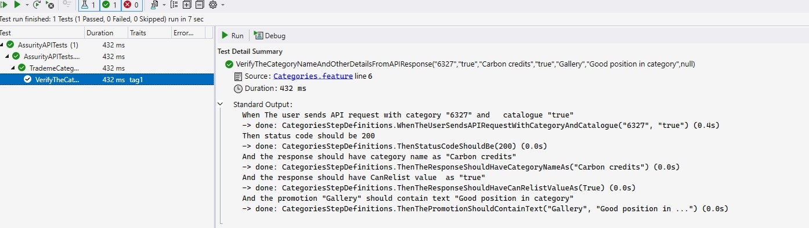
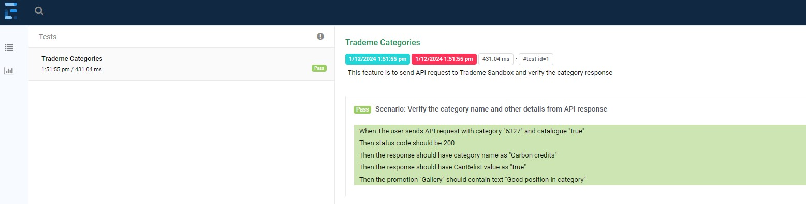
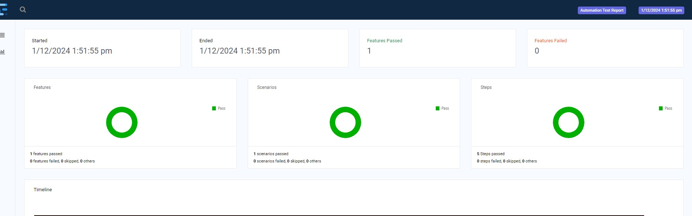

# Assurity API Tests

This project is a SpecFlow-based solution for automating API tests. It leverages SpecFlow for Behavior-Driven Development (BDD) and integrates with RestSharp for HTTP requests, along with additional utilities for logging and reporting.

## Project Overview

The project aims to validate the functionality of APIs under test by using SpecFlow's Gherkin-based scenarios. It includes structured step definitions, request helpers, response validation, and configuration files to adapt across environments.

## Project Structure

### **Requests**
Contains classes for handling API endpoints and requests for various APIs.

-   CategoryRequests.cs: Handles requests for the categories API.
-   ApiEndPointBuilder.cs:  The class is a designed for constructing API endpoint URIs dynamically to ensures API requests are flexible and adaptable to various configurations and parameters.
### **Features**
Holds `.feature` files written in Gherkin syntax to describe test scenarios in a human-readable way.
- **`Categories.feature`** – Contains scenarios for validating the categories API.

### **Hooks**
Contains SpecFlow hooks (e.g., `BeforeScenario`, `AfterScenario`) to set up and tear down resources required for tests.

- **`Hooks.cs`**: The Hooks class is created to manage pre- and post-test execution tasks. It leverages SpecFlow hooks such as BeforeTestRun, AfterTestRun, BeforeFeature, and others, to set up and clean up resources, log relevant details, and integrate the Extent Reports for advanced reporting capabilities

### **Logger**
Manages logging for test execution.

- **`Logger.cs`**: Centralized logging mechanism using a preferred logging library (e.g., Serilog).

### **Models**
Defines the data models used across the test suite for deserialization and request payloads.

- **`CategoryDetails.cs`** – Represents the structure of a category in the API.

### **Reports**
Handles reporting of test execution results.

- **`ExtentSparkReport_<environment>_<date>_<time>.html`**: Extend reports are named using the format `ExtentSparkReport_<environment>_log_<date>_<time>.html`, where `<environment>` represents the running environment (e.g., `dev`, `test`, `preprod`), `<date>` is the date in `yyyyMMdd` format, and `<time>` is the time in `HHmmss` format. This naming convention helps identify report by environment and timestamp.


### **StepDefinitions**
Contains step definitions that map Gherkin steps to implementation.

- **`CategoriesStepDefinitions.cs`**: Implements step definitions for `Categories.feature`.

### **Utilities**
Includes helper classes for API interaction and response handling.

- **`RequestHelper.cs`**: Manages request creation and execution using RestSharp.
- **`ResponseHelper.cs`**: Provides methods for parsing and validating API responses.
- **`ReportHelper.cs`**: The ReportHelper class initializes and manages Extent Reports for test automation, configuring report settings and ensuring proper generation and finalization of test results.
- **`RequestContextBuilder.cs`**: The RequestContextBuilder class builds and sends HTTP requests with customizable headers and bodies, managing request execution and logging for traceability.


### **Config**
Environment-specific configuration files to manage application settings and API endpoints.

- **`profile.json`**: It is used for runtime environment selection.
- **`appsettings-dev.json`**: It stores development environment settings.
- **`appsettings-test.json`**: It contains testing environment settings.
- **`appsettings-preprod.json`**: It contains pre-production environment settings.

### **Logs**
Manages log files generated by the test execution.

-   **`<environment>_log_<date>_<time>.log`**: Log files are named using the format `<environment>_log_<date>_<time>.log`, where `<environment>` represents the running environment (e.g., `dev`, `test`, `preprod`), `<date>` is the date in `yyyyMMdd` format, and `<time>` is the time in `HHmmss` format. This naming convention helps identify logs by environment and timestamp.

---

## Prerequisites

- .NET 8.0 or later
- SpecFlow Extension for Visual Studio 
- NuGet dependencies:
  - `RestSharp (112.1.0)`
  - `SpecFlow (3.9.40)`
  - `Serilog (4.1.0)` 
  - `ExtendReports (5.0.4)`
  - `Microsoft.NET.Test.Sdk (17.0.0)`


---

## Getting Started
## Clone the Repository
   ```bash
   git clone git@github.com:bindutandon99/AssurityAPITest.git or https://github.com/bindutandon99/AssurityAPITest.git   
   ```
## Run API Tests from the Command Line

Follow these steps to run the API tests and review the generated reports:

1. **Navigate to the API Test Project Folder**:
   Go to the folder containing the `.csproj` file (e.g., `C:\Users\xxxx\source\repos\AssurityAPITests\AssurityAPITests.csproj`).

2. **Run the Tests**:
   Open the command line and execute the following command to run the tests:
   ```bash
   dotnet test -v m AssurityAPITests.csproj
    ```
3. **View the Test Report**:
   Once the test run is complete, open the generated Extent Report located in the Reports folder. The report file will be named using the format:
   ```bash
   ExtentSparkReport_<environment>_log_<date>_<time>.html
   ```
4. **Log File**:
   You can also review the detailed logs of the test run in the log file, named as:
   ```bash
   <environment>_log_<date>_<time>.log
   ```
 ## Execute Tests from Visual Studio

Follow these steps to run your tests in Visual Studio:

1. **Open the Solution**:
   Double-click the `AssurityAPITests.sln` file to open the solution in Visual Studio.
   
2. **Build the Solution**:
   Make sure the solution compiles successfully. You should see your tests appear in the Test Explorer panel after a successful build.   

3. **Open Test Explorer**:
   Go to `Test > Test Explorer` from the Visual Studio menu to open the Test Explorer panel.

4. **Run Tests**:
   Right-click on the tests in the Test Explorer panel and select `Run All` or choose specific tests to run.

**Test Result**



**Extent Report Tests Result**



**Extent Report Summary Result**


